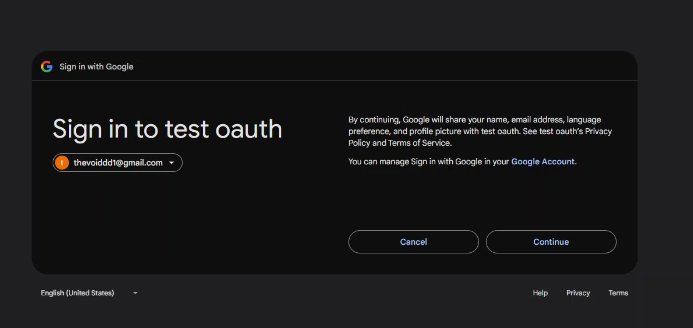

# OAuth 2.0 and OpenID Connect (OIDC) Implementation in Golang

This project demonstrates the implementation of OAuth 2.0 and OpenID Connect (OIDC) using Golang. It provides a secure way to authenticate and authorize users in your applications.

## Introduction

OAuth 2.0 is an authorization framework that enables applications to obtain limited access to user accounts on an HTTP service. OpenID Connect (OIDC) is a simple identity layer built on top of OAuth 2.0, which allows clients to verify the identity of the end-user based on the authentication performed by an authorization server.

This project provides a Golang implementation of both OAuth 2.0 and OIDC, allowing you to integrate secure authentication and authorization into your applications.

## Features

- **OAuth 2.0 Implementation**: Supports authorization code flow, client credentials flow
- **OpenID Connect (OIDC)**: Implements OIDC for user authentication and identity verification.


## Prerequisites

Before you begin, ensure you have the following installed:

- **Go**: [Install Go](https://golang.org/doc/install) (version 1.16 or higher recommended).
- **Git**: [Install Git](https://git-scm.com/book/en/v2/Getting-Started-Installing-Git).
- **OAuth 2.0 Provider**: You need an OAuth 2.0 provider (e.g., Google) to test the implementation.

## Installation

1. Clone the repository:
    create a .env with the following details:
   ```bash
    OAUTH_CLIENT_SECRET= your client secret
    CLIENT_ID= your client id
    ```

```bash
go mod tidy
go build -o goauth
./goauth
```
Start the server:


./oauth2-oidc
Open your browser and navigate to http://localhost:8080/login.

### things which are not demonstrated
1. refresh token flow
2. Uses JWT (JSON Web Tokens) for secure token handling and validation.

sample:

